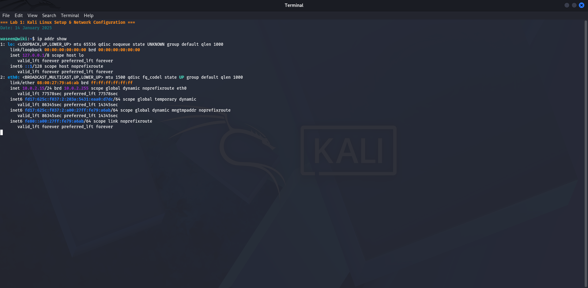
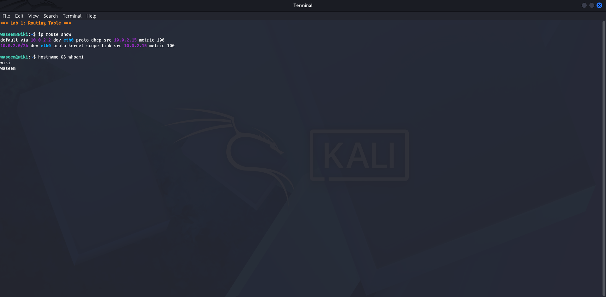
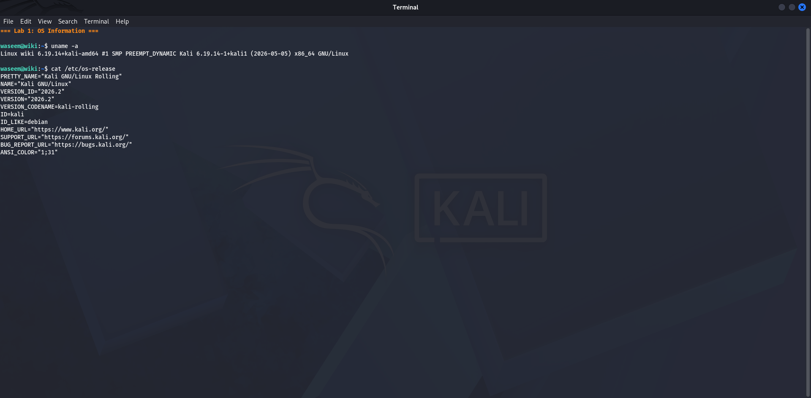
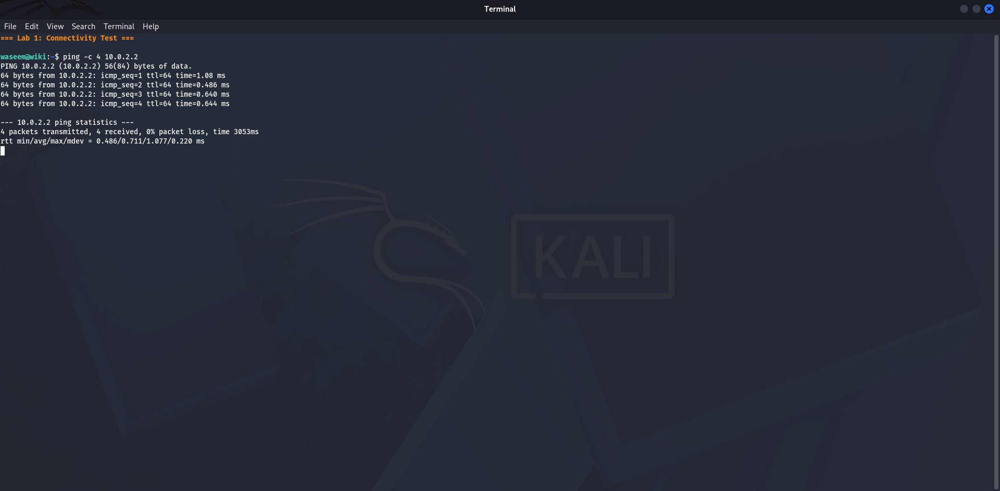

# Lab 1 — Kali Linux Setup & Network Configuration
**Date:** 14 January 2025

## Goal
Start Kali Linux in VirtualBox and confirm the VM's IP address on the NAT network using the terminal.

## Steps
1. Opened Oracle VirtualBox and started the Kali Linux VM named "wiki"
2. Logged in as user `waseem`
3. Opened a terminal window
4. Ran `ip addr show` to display all network interfaces and their IP addresses

## Result
- **eth0:** 10.0.2.15/24 (VirtualBox NAT interface)
- **lo:** 127.0.0.1/8 (loopback)
- Default gateway: 10.0.2.2
- DNS server: 10.0.2.3
- Full subnet: 10.0.2.0/24

## What I Learned
Using `ip addr show` displays every network interface and its assigned IP address. In VirtualBox NAT mode, Kali always receives the IP 10.0.2.15. Knowing your own IP is the first step before scanning anything else on the network.

## Screenshots

