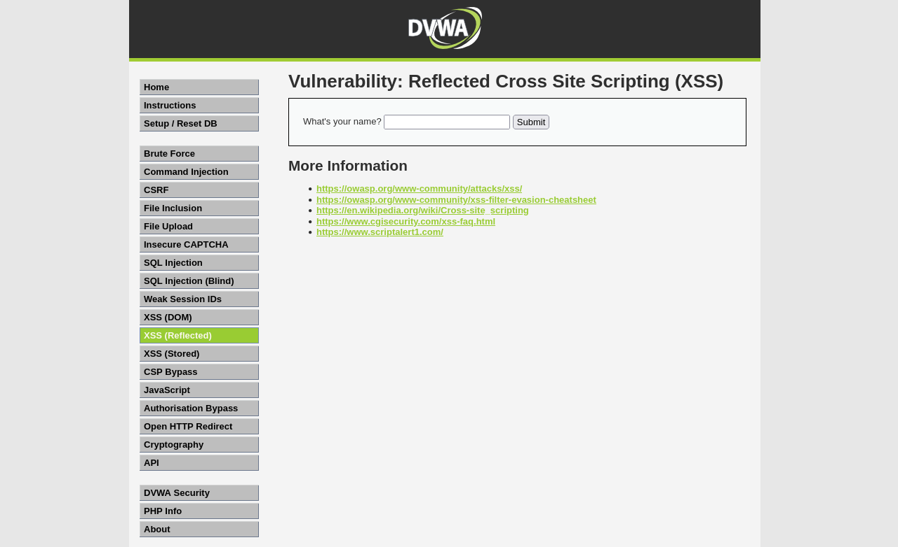
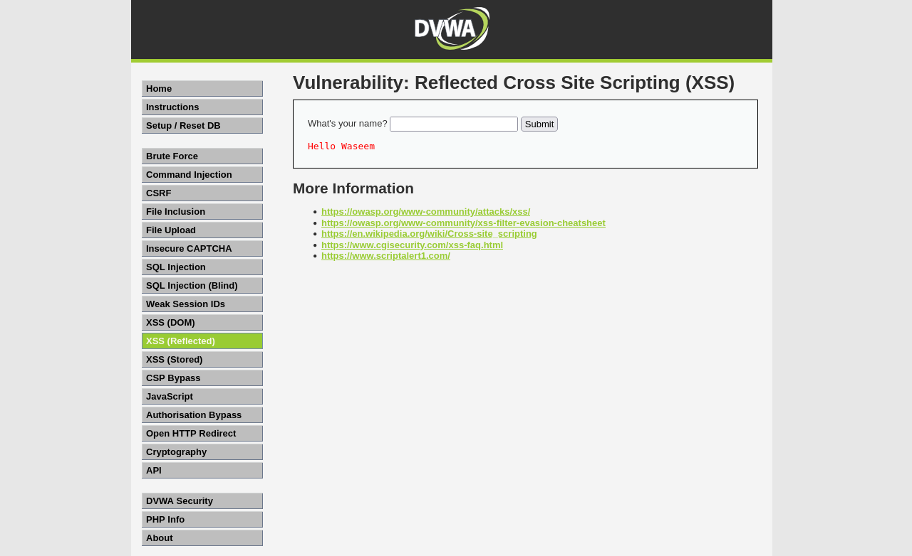
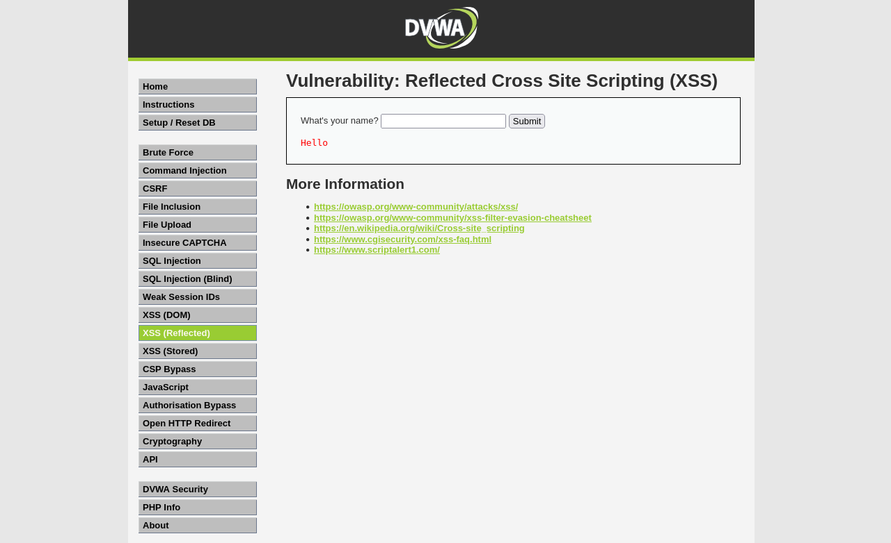
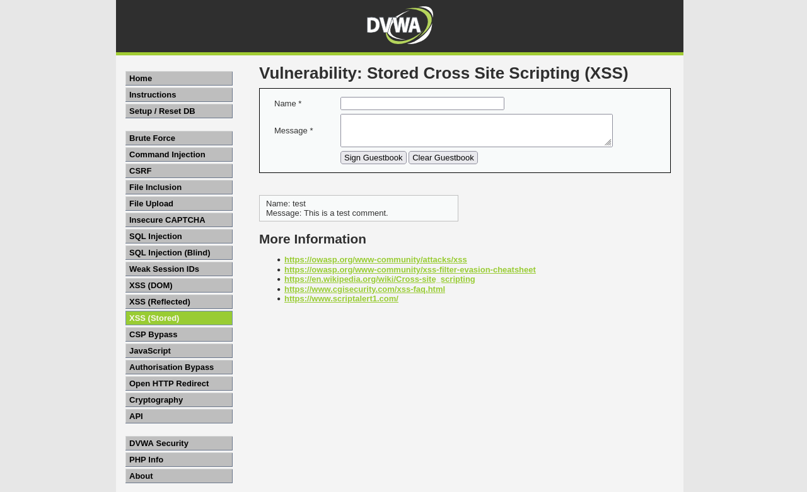
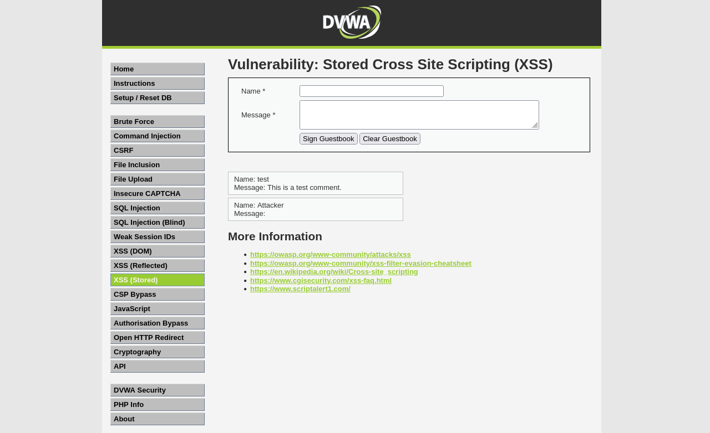

# Lab 10 — Cross-Site Scripting (XSS)
**Date:** 09 June 2025

## Goal
Exploit reflected and stored XSS vulnerabilities in DVWA to execute JavaScript in the browser without permission.

## Steps
1. Logged into DVWA, set security to Low
2. Went to XSS (Reflected) — entered normal name "Waseem" to see normal output
3. Entered payload `` — browser ran the script
4. Went to XSS (Stored) — entered the same script payload in the guestbook message field
5. Reloaded the guestbook page — stored script ran automatically for every visitor

## Result
- Normal name: reflected as plain text — no issue
- Reflected XSS: **alert dialog fired with "XSS"** — script executed in browser
- Stored XSS: **alert "Stored XSS!" fired** on page load — payload saved in database and runs for every user who visits the page

## What I Learned
XSS happens when a web page outputs user input directly into HTML without encoding it. The browser sees the `<script>` tag as code and runs it. Reflected XSS only affects the current request. Stored XSS is saved in the database and attacks every future visitor — much more dangerous. The fix is to HTML-encode all output using functions like `htmlspecialchars()` in PHP.

## Screenshots

