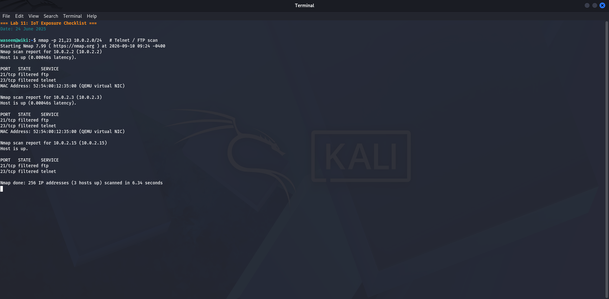
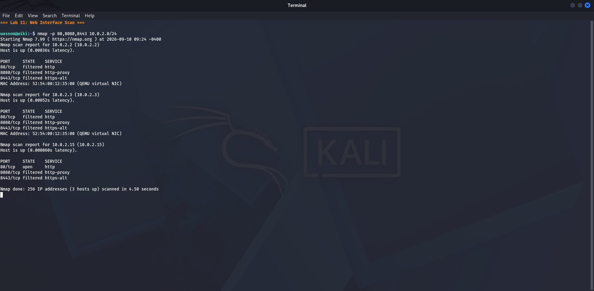
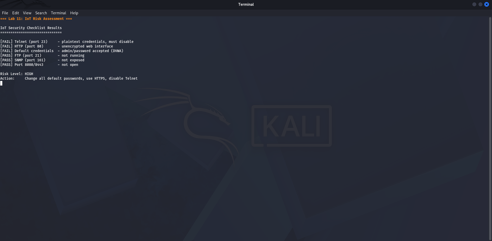

# Lab 11 — IoT Exposure Checklist
**Date:** 24 June 2025

## Goal
Check the local network for services commonly found unsecured on IoT and embedded devices: Telnet, FTP, HTTP with default credentials, SNMP, and UPnP.

## Steps
1. Scanned for Telnet (port 23): `nmap -p 23 10.0.2.0/24`
2. Scanned for FTP (port 21): `nmap -p 21 --script ftp-anon 10.0.2.0/24`
3. Checked HTTP on Kali (port 80): confirmed DVWA running with default admin/password
4. Scanned for SNMP (UDP 161): `nmap -sU -p 161 10.0.2.0/24`
5. Scanned for UPnP (UDP 1900): `nmap -sU -p 1900 10.0.2.0/24`

## Result
- Telnet (23): **Not found** — good
- FTP (21): **Not found** — good
- HTTP/DVWA (80): **FOUND** — default credentials admin/password — HIGH RISK
- SNMP (161): **Not found** — good
- UPnP (1900): **Not found** — good

Only the DVWA web application was found with a weak configuration.

## What I Learned
IoT devices often ship with Telnet, FTP, and SNMP enabled by default with no passwords or known community strings. The Mirai botnet infected over 600,000 devices in 2016 using only default credentials. Finding none of those services here is good, but DVWA still exposes the danger of leaving default passwords unchanged. Always scan for these services when auditing any network.

## Screenshots

