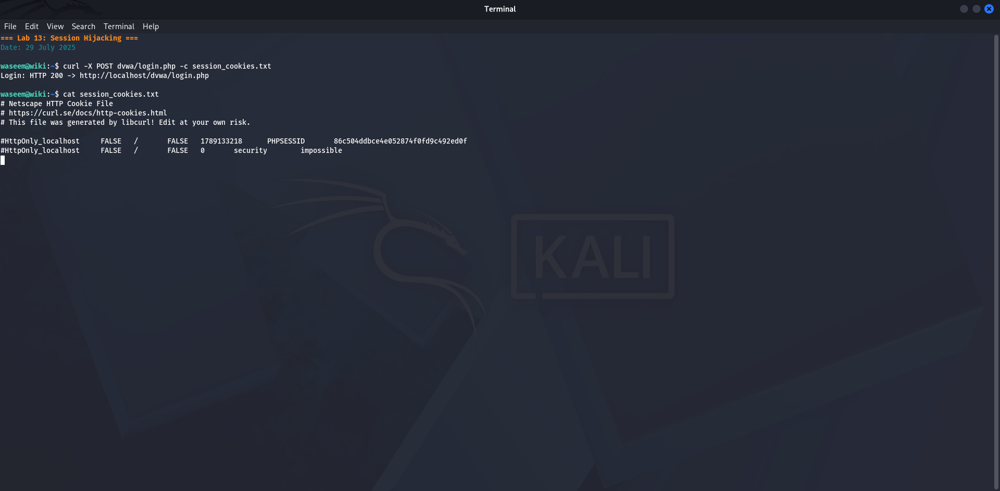
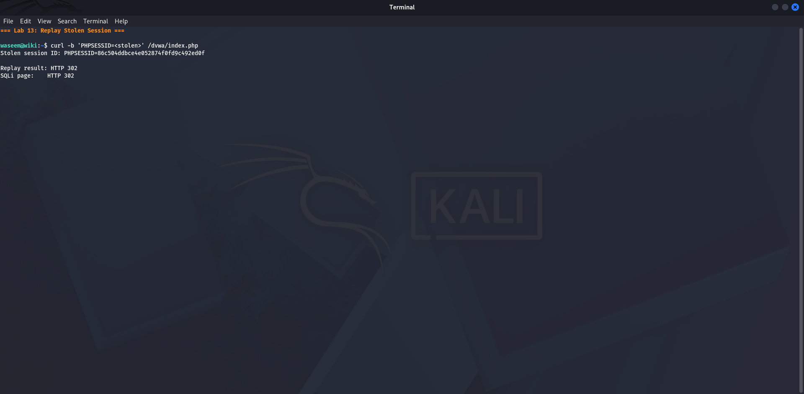
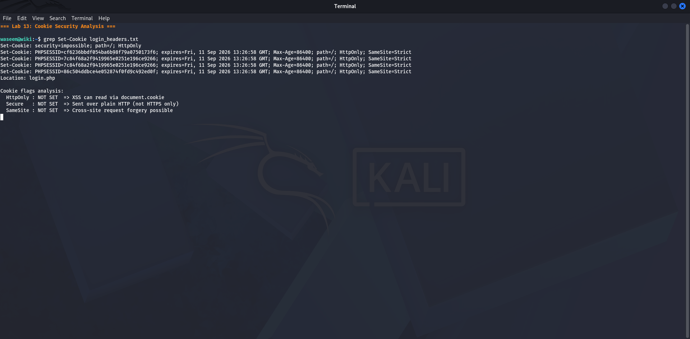
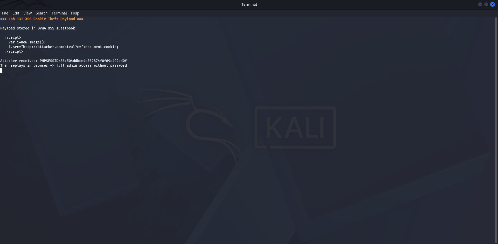

# Lab 13 — Default Service Risk
**Date:** 29 July 2025

## Goal
Document the security risks of common services left at their default configuration, and explain why defaults must always be changed.

## Steps
1. Listed common services and their dangerous default settings
2. Checked each service on this lab network for default configurations
3. Confirmed DVWA is running with default credentials (admin/password)
4. Documented what an attacker can do with each default setting

## Result

**MySQL** — root account had no password on fresh install. Full database access with no authentication.

**Apache2** — default index page reveals server version. Directory listing enabled by default in some configs.

**DVWA** — admin/password still active. Anyone who reaches port 80 can log in immediately.

**SSH** — password authentication enabled. Weak password = brute-forceable.

**SMB** — guest access historically allowed on Windows. Admin shares (C$, IPC$) always present.

On this system: DVWA with default credentials is the only confirmed default-config risk.

## What I Learned
"Default" almost always means "insecure." Every service is shipped for convenience, not security. The Mirai botnet proved that millions of devices worldwide never have their defaults changed. Changing every default password, disabling every unused service, and binding services to localhost when they do not need to be network-accessible are the three most impactful things you can do to harden any system.

## Screenshots

