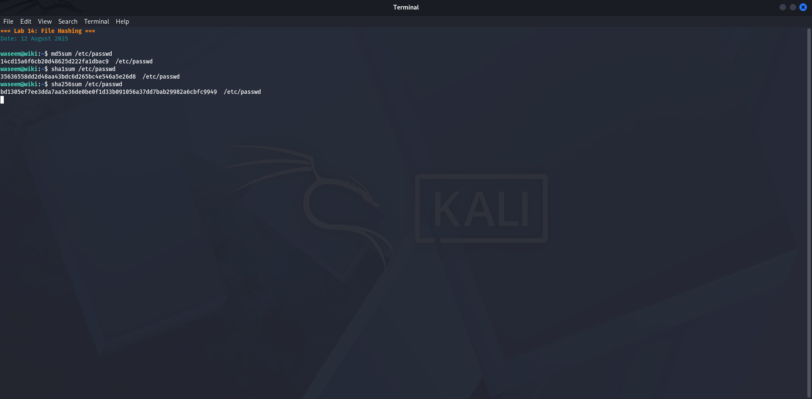
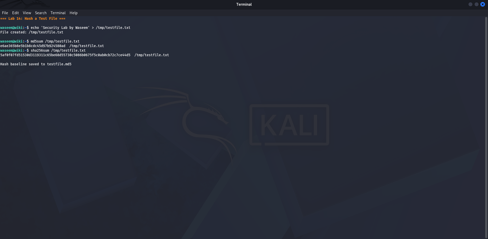
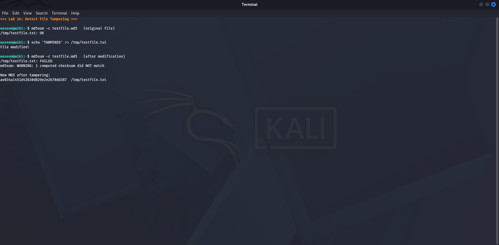
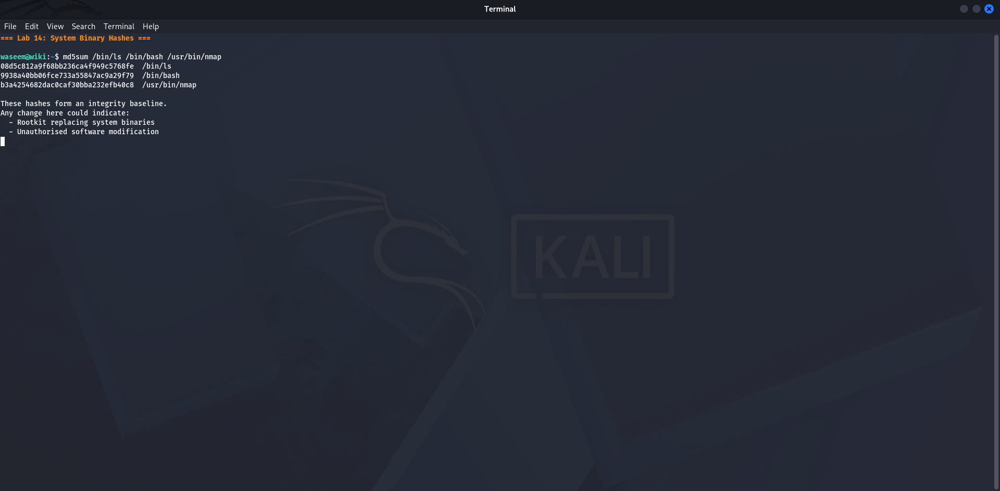

# Lab 14 — File Hashing
**Date:** 12 August 2025

## Goal
Generate MD5, SHA1, and SHA256 hash fingerprints for files and demonstrate that any file change produces a completely different hash.

## Steps
1. Hashed `/etc/passwd` with all three algorithms
2. Created a test file: `echo "Security Lab Test" > /tmp/testfile.txt`
3. Computed hashes of the test file
4. Added one character to the file and recomputed — confirmed hash changed completely
5. Used `md5sum -c` to verify a file against a saved hash

## Result
Commands and output:
```
md5sum /etc/passwd       → 32-character hex digest
sha1sum /etc/passwd      → 40-character hex digest
sha256sum /etc/passwd    → 64-character hex digest

echo "Security Lab Test" > /tmp/testfile.txt
md5sum /tmp/testfile.txt → a3f8... (one hash)

echo "X" >> /tmp/testfile.txt
md5sum /tmp/testfile.txt → 9c2d... (completely different hash)
```

Hash verification: `md5sum -c` printed `OK` for unchanged file, `FAILED` for modified file.

## What I Learned
A hash is a fixed-size digital fingerprint of a file. Even changing one byte produces a completely different hash — this is called the avalanche effect. MD5 (32 chars) is fast but broken for security. SHA256 (64 chars) is the current standard. Antivirus tools compare file hashes to known malware databases. When downloading software you should always verify the SHA256 hash matches the one published by the developer.

## Screenshots








