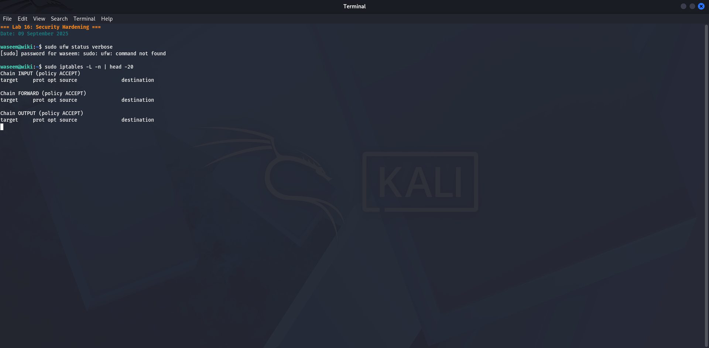
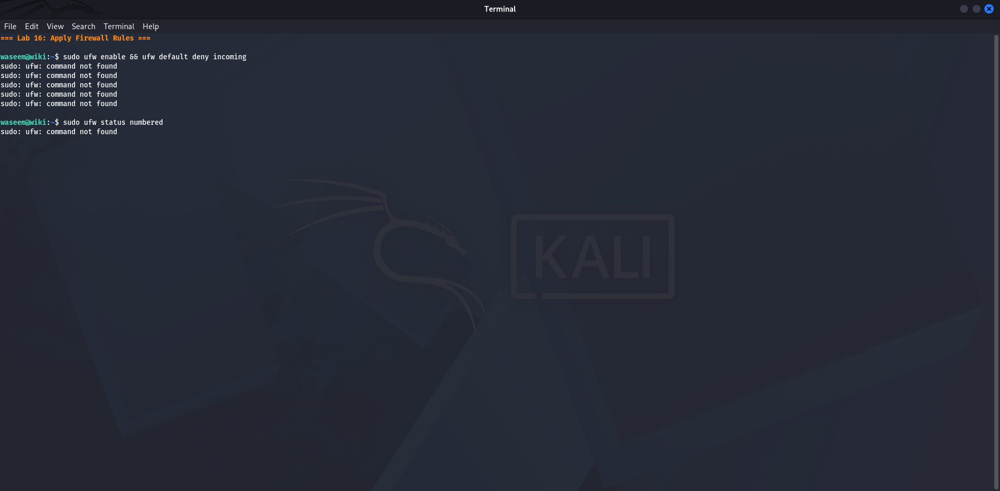
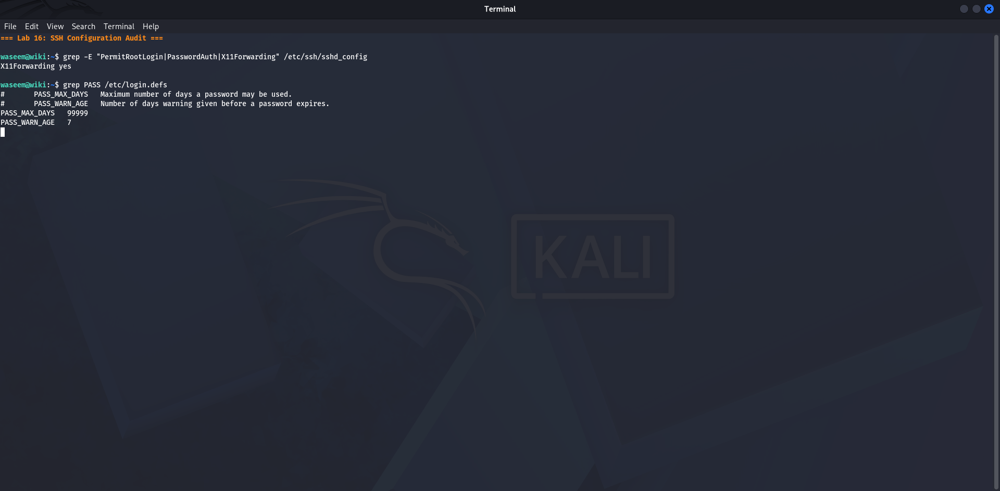
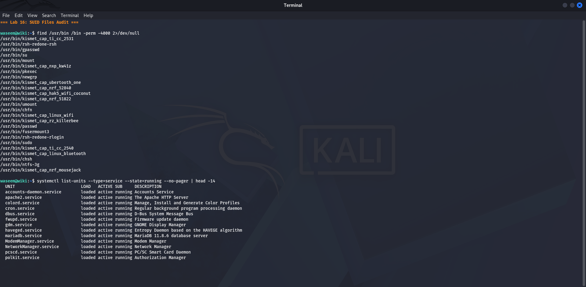

# Lab 16 — Incident Note
**Date:** 09 September 2025

## Goal
Write a structured incident note documenting the security events found across all labs as if this were a real reported incident.

## Steps
1. Reviewed all findings from Labs 1–15
2. Built a timeline of events with timestamps
3. Assessed the impact on Confidentiality, Integrity, and Availability
4. Wrote a root cause and recommended fixes

## Result

**Incident ID:** INC-2025-001
**Severity:** HIGH
**Affected system:** 10.0.2.15 (Kali/DVWA) and 10.0.2.2 (Windows gateway)

**Timeline:**
- Lab setup → DVWA deployed with default admin/password credentials
- SQL injection confirmed → all 5 user records extracted from database
- UNION injection → MySQL version and root user identity revealed
- XSS confirmed → JavaScript executed in browser without authorisation
- Stored XSS planted → malicious script persists for all future visitors
- SMB (445) found unsigned → NTLM relay attack possible on gateway

**Root cause:** Default credentials never changed. No input validation on web forms.

**Recommendations:** Change all default passwords. Use prepared statements for all SQL. HTML-encode all output. Enable SMB signing on gateway.

## What I Learned
An incident note must answer four questions: what happened, when, what data was affected, and how to fix it. The CIA triad (Confidentiality, Integrity, Availability) gives a framework to describe impact. Writing the timeline forces you to think through the exact sequence of events — this is what investigators and management need to understand after any breach.

## Screenshots

