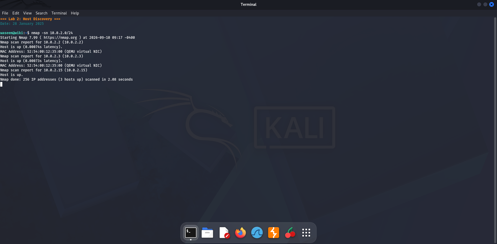
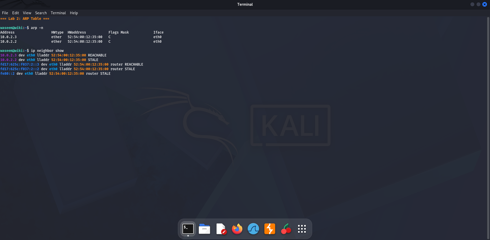
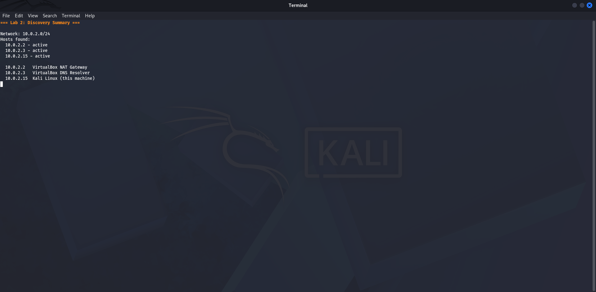

# Lab 2 — Host Discovery
**Date:** 28 January 2025

## Goal
Find all live devices on the local network (10.0.2.0/24) using an nmap ping scan.

## Steps
1. Opened a terminal in Kali Linux
2. Ran: `nmap -sn 10.0.2.0/24`
3. Waited for the scan to complete across all 254 addresses
4. Recorded every host that sent a reply

## Result
Three live hosts discovered:
- **10.0.2.2** — VirtualBox default gateway
- **10.0.2.3** — VirtualBox DNS server
- **10.0.2.15** — Kali Linux (our own machine)

Scan completed in under 3 seconds.

## What I Learned
`nmap -sn` performs a ping sweep — it sends ICMP echo requests and TCP probes to every address in the range and reports which ones reply. No ports are scanned. This is the very first step in any network security assessment: identify who is on the network before probing anything further.

## Screenshots

