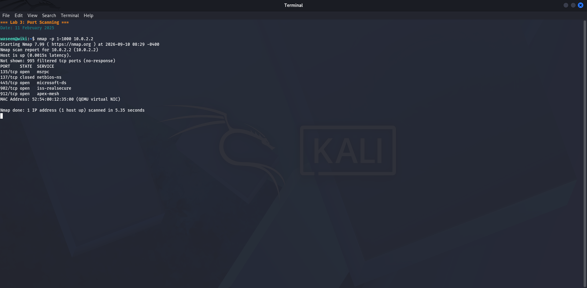
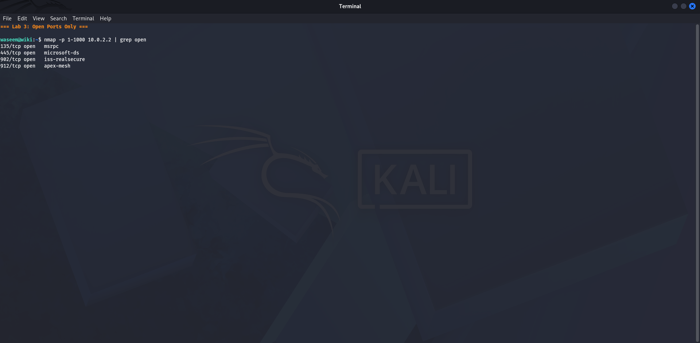
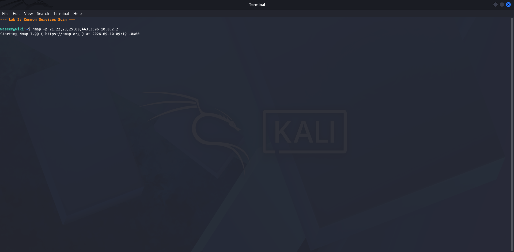
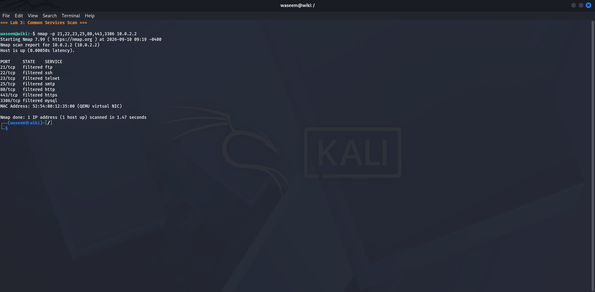

# Lab 3 — Port Scanning
**Date:** 11 February 2025

## Goal
Scan the gateway host (10.0.2.2) to discover which TCP ports are open in the range 1–1000.

## Steps
1. Opened a terminal in Kali Linux
2. Ran: `nmap -p 1-1000 10.0.2.2`
3. nmap sent SYN packets to each port and waited for responses
4. Noted which ports replied as open, closed, or filtered

## Result
- **135/tcp** — open (Windows RPC)
- **137/tcp** — closed
- **445/tcp** — open (SMB file sharing)
- **902/tcp** — open (VMware Auth Daemon)
- **912/tcp** — open (VMware Auth Daemon)

## What I Learned
A port scan reveals what services are accepting connections on a target. Open ports are the attack surface — each one is a potential entry point. Ports 135 and 445 are standard Windows services. Ports 902 and 912 are VMware-specific management ports, which tells us the target machine is running virtualization software.

## Screenshots

