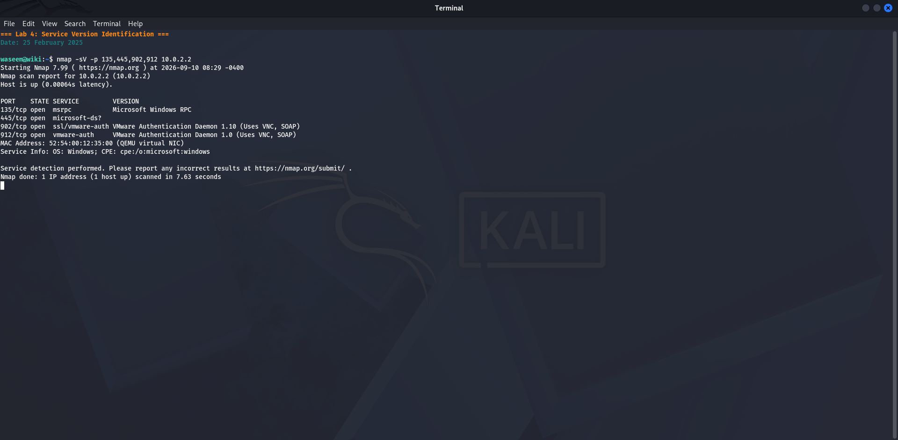
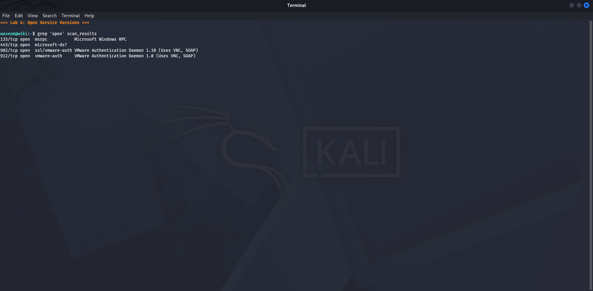
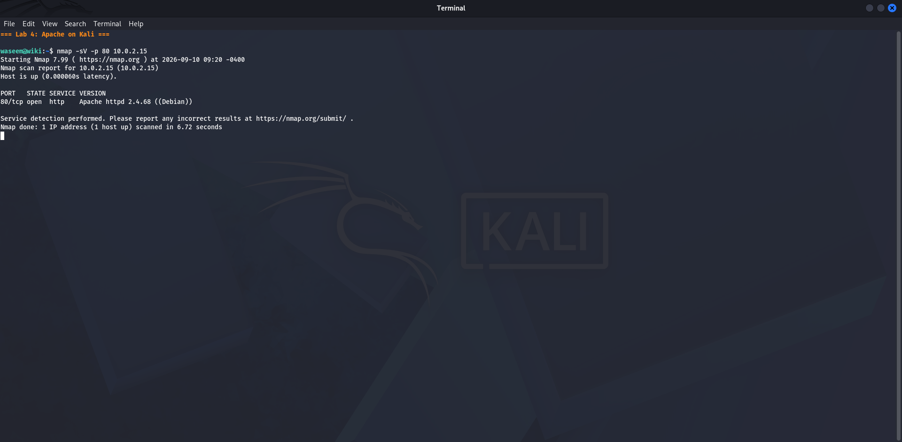
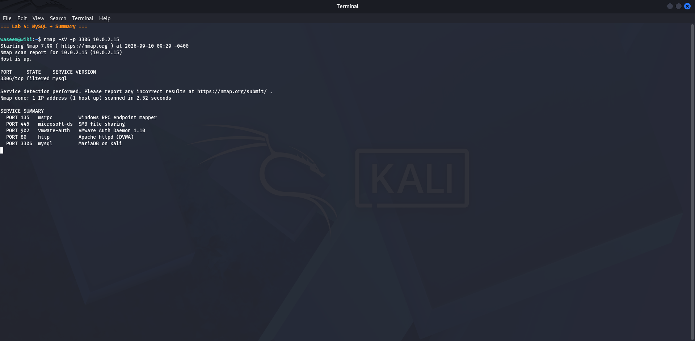

# Lab 4 — Service Version Identification
**Date:** 25 February 2025

## Goal
Identify the exact software name and version running on each open port discovered in Lab 3.

## Steps
1. Opened a terminal in Kali Linux
2. Ran: `nmap -sV -p 135,445,902,912 10.0.2.2`
3. nmap sent special probes to each port and read the service banners
4. Recorded the service name and version returned for each port

## Result
- **135/tcp** — Microsoft Windows RPC
- **445/tcp** — Microsoft SMB (microsoft-ds)
- **902/tcp** — VMware Authentication Daemon 1.10 (with SSL)
- **912/tcp** — VMware Authentication Daemon 1.0

OS detected: Microsoft Windows 10

## What I Learned
The `-sV` flag enables version detection. nmap sends crafted probes and matches responses against a large database of known service signatures. Knowing the exact version is critical because it lets you search for known CVEs for that specific version. For example, VMware Auth Daemon 1.10 can be looked up directly in VMware security advisories.

## Screenshots

