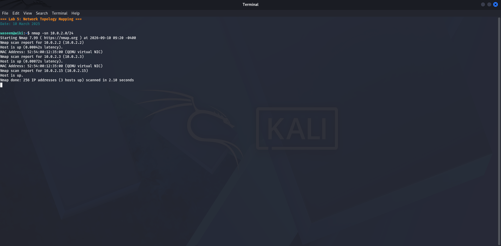
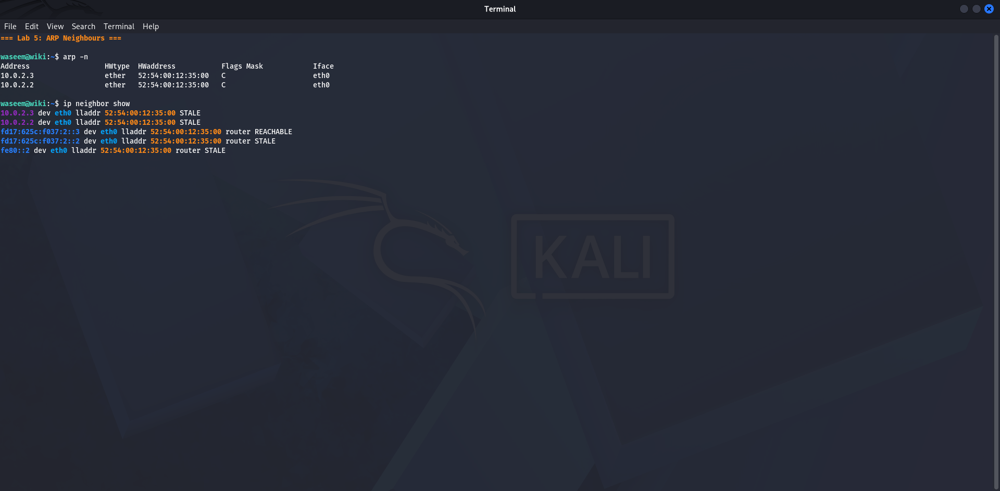
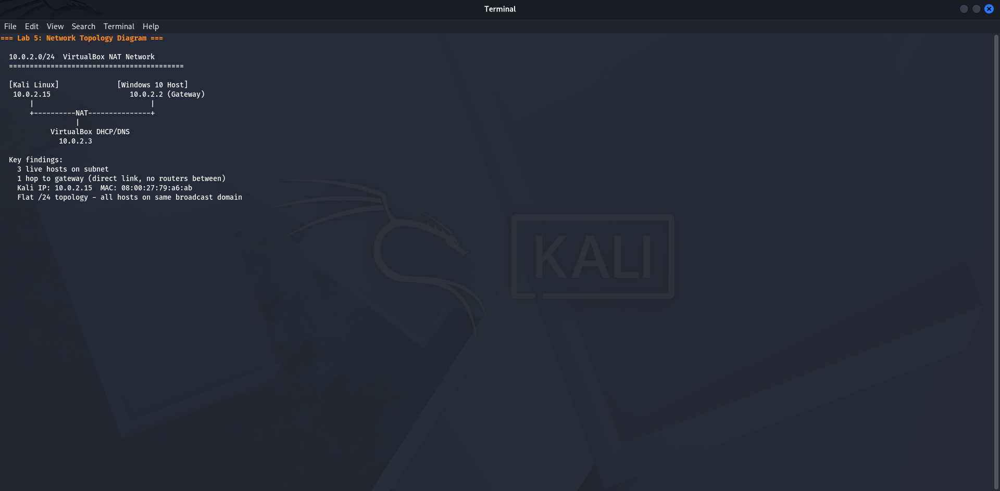

# Lab 5 — Network Map
**Date:** 10 March 2025

## Goal
Build a visual map of the entire discovered network showing all hosts, their IPs, roles, and connections.

## Steps
1. Collected all host and port data from Labs 1–4
2. Drew a network topology showing how hosts connect
3. Listed each host's role and open services
4. Documented the network type and boundaries

## Result

```
              [ INTERNET ]
                   |
        +----------+----------+
        |   Windows 10 Host   |
        |     10.0.2.2 (GW)   |
        |     10.0.2.3 (DNS)  |
        |  Ports: 135,445,    |
        |         902,912     |
        +----------+----------+
                   |
            NAT Network
           10.0.2.0/24
                   |
        +----------+----------+
        |   Kali Linux VM     |
        |   "wiki"            |
        |   10.0.2.15/24      |
        |   Port 80 (DVWA)    |
        +---------------------+
```

- 3 total hosts discovered
- 5 open ports on gateway
- Kali runs DVWA web application on port 80

## What I Learned
A network map turns raw scan data into something you can read at a glance. It shows relationships between hosts, which services face the network, and where the boundaries are. In a real engagement, this map guides which hosts to focus on and what attack paths exist between them.

## Screenshots








