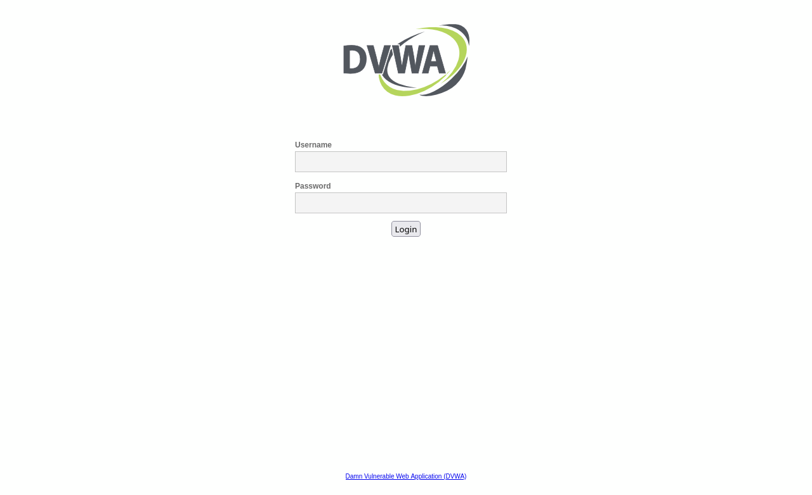
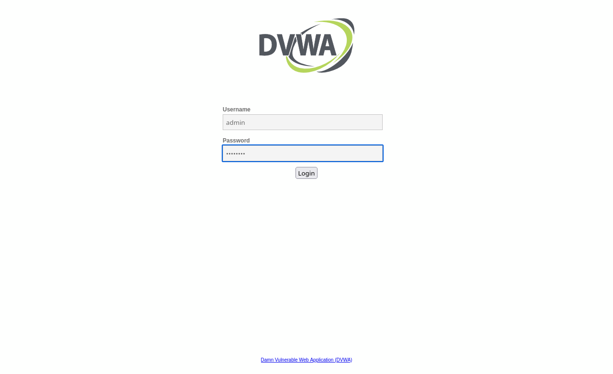
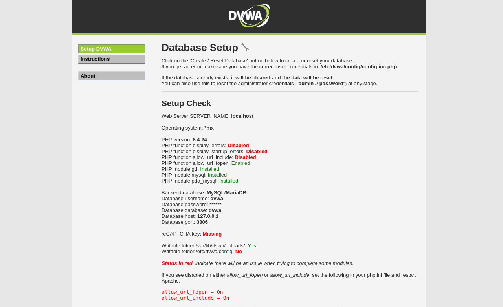
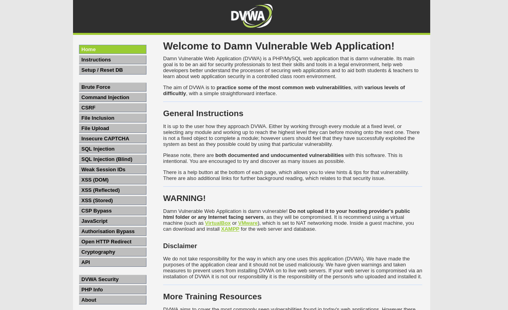
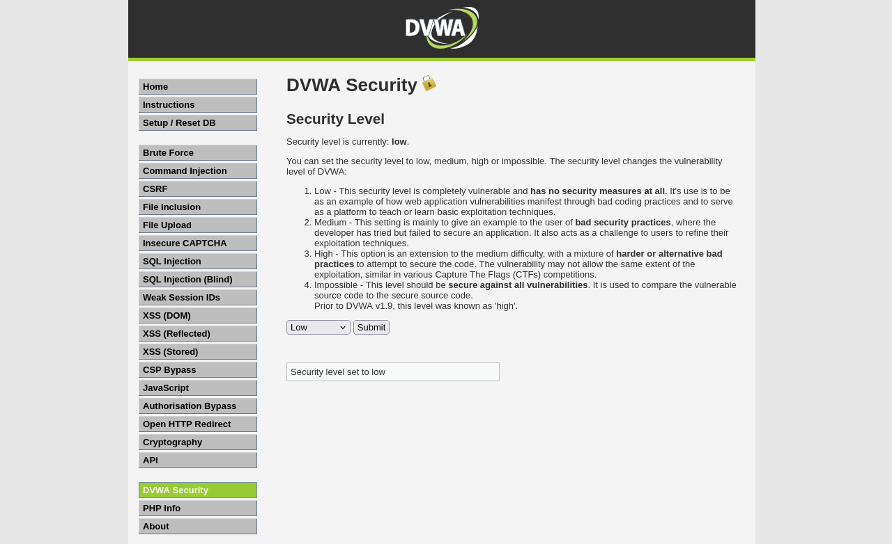
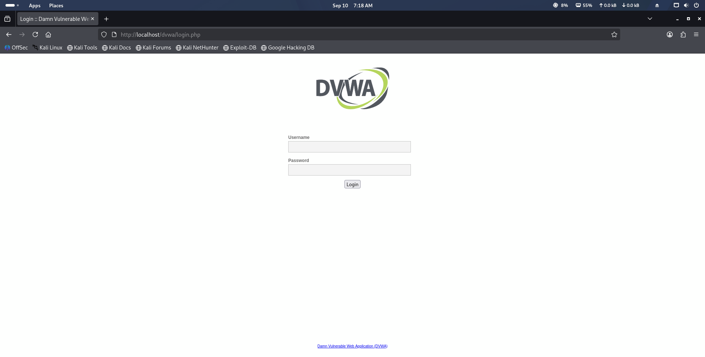

# Lab 8 — DVWA Setup & Login
**Date:** 06 May 2025

## Goal
Set up DVWA (Damn Vulnerable Web Application) on Kali Linux and log in successfully through the browser.

## Steps
1. Started Apache2 and MySQL: `sudo systemctl start apache2 mysql`
2. Created symlink: `sudo ln -sf /usr/share/dvwa /var/www/html/dvwa`
3. Opened Firefox and went to `http://localhost/dvwa/setup.php`
4. Clicked "Create / Reset Database" to initialise the database
5. Navigated to `http://localhost/dvwa/login.php`
6. Logged in with default credentials: **admin / password**
7. Set security level to **Low** at DVWA Security page

## Result
- DVWA running at `http://localhost/dvwa/`
- Database created successfully
- Login successful — DVWA dashboard visible
- Security level set to Low (no input validation)

## What I Learned
DVWA is a PHP/MySQL web application built to practice web attacks legally. Setting security to "Low" removes all input filtering, making it easy to test SQL injection and XSS. The default credentials (admin/password) represent the most common real-world misconfiguration — leaving factory defaults unchanged.

## Screenshots

