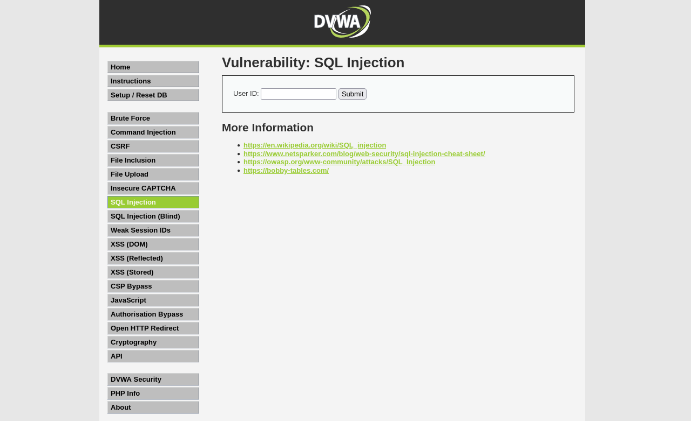
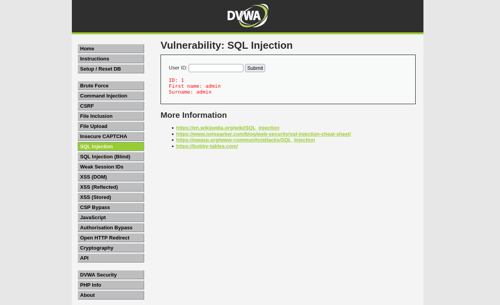
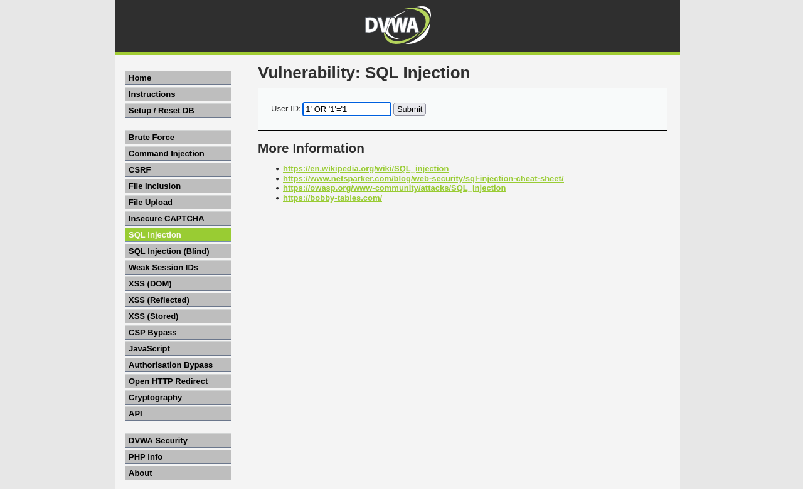
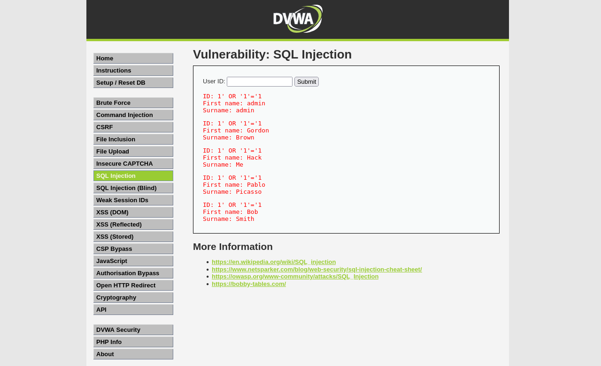
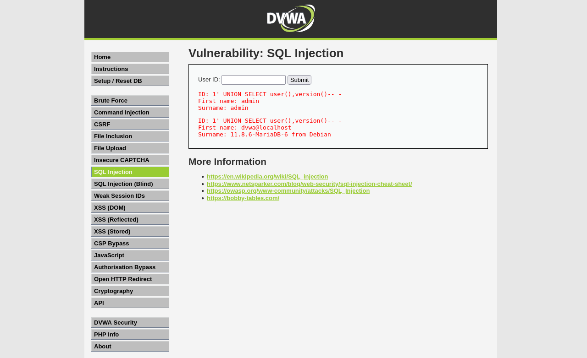

# Lab 9 — SQL Injection
**Date:** 21 May 2025

## Goal
Exploit the SQL injection vulnerability in DVWA to extract all user records from the database without a valid ID.

## Steps
1. Logged into DVWA and navigated to SQL Injection page
2. Entered `1` as a normal User ID — confirmed one user returned
3. Entered payload `1' OR '1'='1` — this makes the WHERE condition always true
4. All users in the database were returned
5. Entered `1' UNION SELECT user(),version()-- -` to dump the database version and current user

## Result
- Normal query (ID=1): returned admin's name only
- OR injection: **all 5 users dumped** — admin, Gordon Brown, Hack Me, Pablo Picasso, Bob Smith
- UNION injection: returned `root@localhost` and MySQL version string

## What I Learned
SQL injection happens when user input goes directly into a SQL query without any sanitisation. The single quote `'` breaks out of the string context. `OR '1'='1'` is always true so it bypasses the ID filter and returns everything. UNION SELECT lets you attach a second query to read any table or call database functions. The fix is always to use parameterised queries (prepared statements) — never string-build SQL with user input.

## Screenshots

